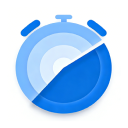

<h1>Re:lax</h1>

<strong>because you forgot to stop ~</strong>

 

## The Art of Stopping.

> The most productive thing you can do is, sometimes, **nothing at all**.

We built **Re:lax** for the deep thinkers, the late-night coders, and the digital craftsmen who lose themselves in their work. In an era of endless tasks and non-stop grinding, the hardest thing to do is to simply stop.

## Highlights

- **Hard Stop.** No "Skip" button. No "Snooze." When it’s time to rest, the work ends.
- **Your Space.** Set your own backdrops and reminders. Make the mandatory break your own.
- **Pure Intent.** It stays out of your way until you’ve pushed too far. Then, it saves you from yourself.

## Download

**Get Re:lax → [macOS & Windows](https://github.com/idootop/relax/releases)**

## License

MIT License © 2026-PRESENT [Del Wang](https://github.com/idootop)
